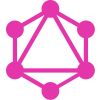
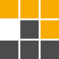

  
    

  <h1>🧭 Hi, I'm Kacper</h1>

   

  

 

<h3 align="center">🛠 Tech Stack</h3>

Icons by <a href="https://www.tech-stack-icons.com/">Tech Stack Icons</a>

#### Languages

  
  
  
  
  
  
  

#### Frontend

  
  
  
  
  
  
  

#### Backend & API

  
  
  
  

#### Databases & Data

  
  
  
  
  
  
  
  
  

#### DevOps & Cloud

  
  
  
  
  
  

#### Testing

  
  
  

#### Styling & UI

  
  
  
  

#### Tools

  
  
  
  
  
  
  
  
  
  
  
  
  

